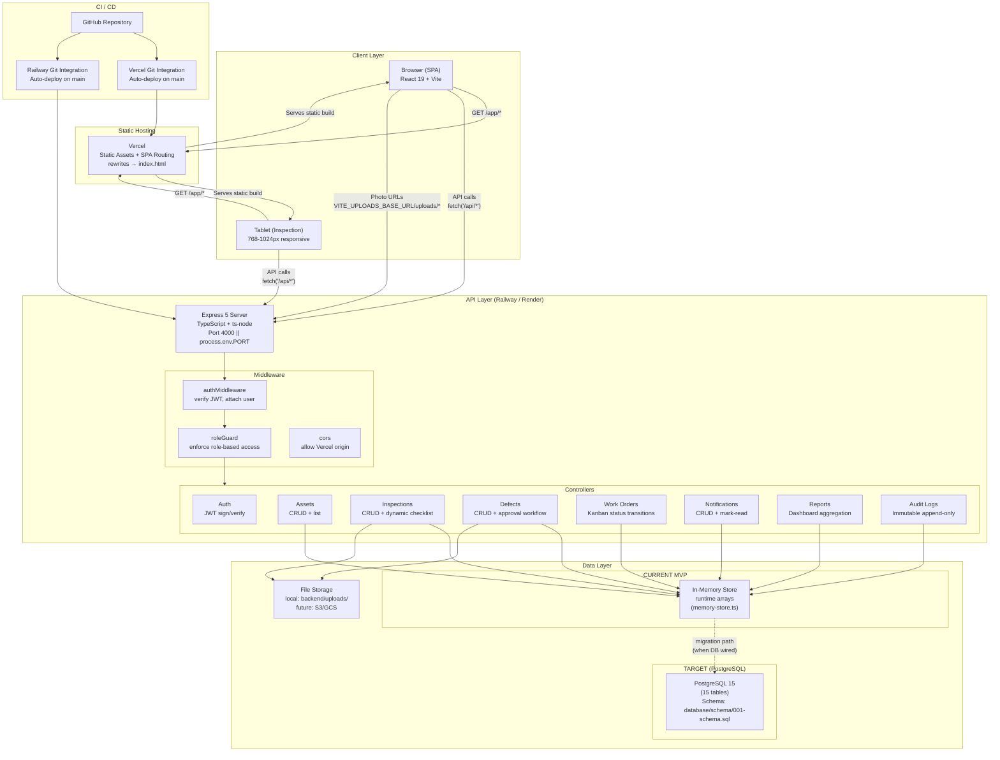

# EAOP — System Architecture Diagram



## Component Details

### Frontend (Vercel)
- **Framework:** React 19 + TypeScript + Vite 6
- **State Management:** TanStack React Query v5 (server state), React Context (auth state)
- **Styling:** Tailwind CSS 3 + shadcn/ui (Radix UI primitives)
- **Routing:** React Router v6 with lazy-loaded feature modules
- **Build Output:** Static SPA (`npm run build` → `frontend/dist/`)
- **Deployment:** Vercel with `vercel.json` rewrites all routes to `index.html`
- **Env Vars:** `VITE_API_BASE_URL` (API proxy path), `VITE_UPLOADS_BASE_URL` (backend origin for photos)

### Backend (Railway / Render)
- **Runtime:** Node.js 22 + Express 5 + TypeScript
- **Auth:** JWT-based (bcrypt + jsonwebtoken), no session store
- **API Style:** RESTful JSON, ~25 endpoints
- **Photo Uploads:** Multer middleware → `backend/uploads/` directory
- **Current MVP Storage:** In-memory arrays in `backend/src/repositories/memory-store.ts` — all controllers read/write runtime arrays (7 users, 3 plants, 20 assets, seed data for all entities including defects, work orders, inspections, notifications, audit logs). No database dependency.
- **Port:** Default 4000, overridable via `PORT` env var
- **CORS:** Whitelist Vercel production origin + localhost for dev

### Database — Target (PostgreSQL 15, not yet wired)
- **Hosting:** Railway's built-in PostgreSQL or Render PostgreSQL
- **Schema:** 15 tables (defined in `database/schema/001-schema.sql`), UUID primary keys, CHECK constraints for enums
- **Connections:** Pool managed by `pg` or `postgres.js` (to be wired in a future iteration; currently all data lives in the in-memory store)
- **Seed Data:** `database/seed/seed.sql` with realistic plant maintenance data (prepared, not yet loaded)
- **Migration Strategy:** The controller → repository interface is designed to swap from `memory-store.ts` to `pg-store.ts` with zero controller changes — only the repository import needs to change

### Request Flow

```
1. User opens app        → Vercel serves index.html + JS bundle
2. User logs in          → POST /api/auth/login → JWT returned
3. JWT stored in localStorage (simplified flow, FSMOD §16)
4. Subsequent API calls  → fetch('/api/inspections') with Authorization header
5. Vite dev proxy        → /api/* proxied to localhost:4000
6. Production            → Vercel env VITE_API_BASE_URL points to Railway origin
7. Photo upload          → fetch('/api/inspections/:id/photo', FormData)
8. Photo display         → toAbsolutePhotoUrl(relativePath) → VITE_UPLOADS_BASE_URL + path
```

### Key Architecture Decisions (see ADRs)
| ADR | Decision |
|-----|----------|
| ADR-001 | React 19 + Vite as frontend framework |
| ADR-002 | Button-based Kanban (no drag-and-drop) |
| ADR-003 | Approval on Defect Detail (no separate module) |
| ADR-004 | REST API (not GraphQL) |

### Environment Variables (Production Checklist)

| Variable | Where Set | Purpose |
|----------|-----------|---------|
| `VITE_API_BASE_URL` | Vercel | Backend API origin for production (e.g. `https://eaop-api.railway.app`) |
| `VITE_UPLOADS_BASE_URL` | Vercel | Backend origin for photo URLs (e.g. `https://eaop-api.railway.app`) |
| `PORT` | Railway/Render | Server port (default 4000, Railway uses `process.env.PORT`) |
| `JWT_SECRET` | Railway/Render | HS256 signing key for JWT tokens |
| `CORS_ORIGIN` | Railway/Render | Allowed origin (Vercel production URL) |
| `DATABASE_URL` | Railway/Render | PostgreSQL connection string (when DB mode active) |